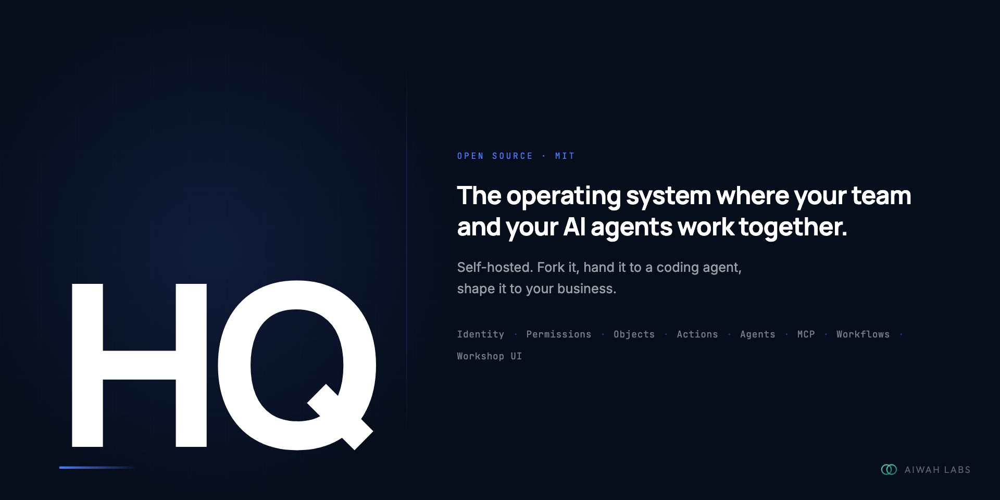

<p align="center">
  
</p>

# HQ

> **Early preview.** Not production ready. APIs will change. [Watch releases](https://github.com/aiwah-labs/hq/releases).

**The operating system where your team and your AI agents work together.**

HQ is a template for self-hosted business infrastructure. Clone it, hand it to a coding agent, and shape it to what your business does. Your data stays in your database. Your logic lives in your codebase.

[Quick start](#quick-start) · [The platform](#the-platform) · [Connect your agents](#connect-your-agents) · [Docs](./docs) · [Deploy](./DEPLOY.md)

---

## Quick start

You'll need Node 22, pnpm 10, and Docker.

```bash
git clone https://github.com/aiwah-labs/hq
cd hq
pnpm install
pnpm db:local:bootstrap
pnpm dev:platform
```

Open http://localhost:3002 and log in with `admin@example.com` / `password`.

```bash
pnpm doctor      # check your setup
pnpm db:studio   # browse the database
pnpm mcp         # run the MCP server
```

---

## The platform

HQ gives you the pieces you'd build anyway — objects, actions, permissions, workflows, an admin UI, and an MCP server — so you can skip the first three months and get to the work only you can do.

**Objects** are the things your business runs on. Contacts, deals, projects, whatever it is you track. Define the shape once and every part of the platform picks it up: the API, the admin UI, the agents.

**Actions** are what happens to those objects. A human clicking a button, an agent calling a tool, a workflow step — they all hit the same code path with the same permissions. You write the action once. You don't write it again for each caller.

**Agents** are the AI that works inside the system. They have access to your data, your actions, and your team's context. They answer messages, react to events, run on a schedule, or show up as a step in a workflow.

**Workflows** chain actions together. You define them in code. They run on a schedule, on an event, or on demand. They handle the repetitive stuff nobody should have to think about.

**Workshop** is where your team works from. One place for records, workflow runs, agent activity, and things waiting for approval.

**MCP** is the door from the outside. Claude Desktop, Cursor, OpenClaw — any MCP client gets typed access to your actions and data. No extra plumbing.

**Permissions** decide who can do what. People have roles. Agents have scopes. High-risk actions wait for a human to say yes before they run.

---

## Connect your agents

```json
{
  "mcpServers": {
    "hq": {
      "command": "node",
      "args": ["/path/to/hq/apps/mcp/dist/server.js"],
      "env": { "MCP_BOT_API_KEY": "your-key" }
    }
  }
}
```

Drop that into Claude Desktop, OpenClaw, Hermes, or any other MCP client. Your actions show up automatically.

---

## Build your domain

HQ ships with two example modules — a CRM and Projects/Tasks. Real working code, not stubs. Read them, copy what's useful, delete the rest.

- [Add an object](./docs/add-object.md)
- [Add an action](./docs/add-action.md)
- [Add a workflow](./docs/add-workflow.md)
- [Add an agent](./docs/add-agent.md)
- [Build a full module](./docs/example-modules/README.md)

---

## Deploy

```bash
curl -fsSL https://raw.githubusercontent.com/aiwah-labs/hq/main/scripts/setup-server.sh | bash
git clone https://github.com/aiwah-labs/hq /opt/hq
cd /opt/hq && cp .env.example .env.prod
# Fill in DATABASE_URL, SESSION_SECRET, INTERNAL_API_SECRET
bash scripts/first-deploy.sh && bash scripts/setup-nginx.sh your-domain.com
```

Full guide in [DEPLOY.md](./DEPLOY.md).

---

## Contributing

Issues and PRs welcome. See [CONTRIBUTING.md](./CONTRIBUTING.md). Security issues in [SECURITY.md](./SECURITY.md).

---

MIT · Built by [Aiwah Labs](https://aiwahlabs.com) · Questions? [abil@aiwahlabs.com](mailto:abil@aiwahlabs.com)
